# Backend Migration: Laravel → Next.js API Routes

Migrate the old Laravel backend (`githubactioneducationmalaysia`) into the existing Next.js app using the same MySQL database and Prisma ORM. Deploy on VPS with phased migration — Laravel stays as fallback.

---

## Phase 1 Analysis Summary

### Old Backend Architecture

| Layer | Count | Key Files |
|-------|-------|-----------|
| **API Controllers** | 24 | `UniversityApi` (800L), `InquiryApi` (744L), `StudentProfileApi` (625L), `StudentAuthApi` (469L) |
| **Eloquent Models** | 111 | `University`, `Lead`, `UniversityProgram`, `Blog`, `CourseCategory`, etc. |
| **API Endpoints** | ~80 | Grouped: content (40), auth (8), inquiry (7), student profile (15), search (10) |
| **Middleware** | 6 | `CheckApiKey` (X-API-KEY header), `BlockPageQueryParam`, `HtmlCacheHeaders` |
| **Services** | 2 | `SeoMetaService` (64KB), `BreadcrumbService` (11KB) |
| **Helpers** | 40+ | `replaceTag`, `slugify`, `unslugify`, `j2s`, CDN/storage helpers |
| **Email Templates** | 13 | OTP, inquiry-reply, inquiry-to-team, forget-password, welcome |

### 4 Major Subsystems

```mermaid
graph TB
    A[Content APIs] --> A1[Universities 12 endpoints]
    A --> A2[Courses/Specializations 8 endpoints]
    A --> A3[Blog/Exams/Services 8 endpoints]
    A --> A4[Scholarships/FAQs 4 endpoints]
    A --> A5[Sitemap 12 endpoints]
    
    B[Student Auth] --> B1[Register + OTP]
    B --> B2[Login + Token]
    B --> B3[Forget/Reset Password]
    B --> B4[Email Login via Link]
    
    C[Lead Generation] --> C1[7 Inquiry Forms]
    C --> C2[Dual Email: User + Team]
    C --> C3[Auto-assign Counselor]
    C --> C4[Brochure Attachments]
    
    D[Student Dashboard] --> D1[Profile CRUD]
    D --> D2[Schools CRUD]
    D --> D3[Test Scores GRE/GMAT/SAT/IELTS]
    D --> D4[Documents Upload]
    D --> D5[Apply/Shortlist Programs]
```



### Key Business Logic Patterns

1. **SEO Tag Replacement** — `replaceTag()` replaces `%title%`, `%currentyear%`, etc. in all SEO meta fields. Used in every content endpoint.
2. **Website Scope** — Global scope `WebsiteScope` filters all queries by `website = 'MYS'`. Must be preserved.
3. **Auth Model** — Students are stored in `leads` table (not a separate `users` table). `Lead` model has Sanctum `HasApiTokens`.
4. **Lead Auto-Assignment** — `AsignedLead::autoAssign($leadId)` round-robins leads to counselors.
5. **Dual Email Pattern** — Every inquiry sends (a) confirmation to user, (b) alert to team with CC/BCC.

---

## User Review Required

> [!IMPORTANT]
> This migration reuses the **existing MySQL database** and **existing Prisma schema** (3,355 lines). No new tables or migrations needed — all endpoints will use `prisma.university`, `prisma.lead`, etc. directly.

> [!WARNING]
> The old system stores passwords with `bcrypt` via Laravel's `Hash::make()`. The new auth system must use the same bcrypt algorithm (via `bcryptjs`) to maintain backward compatibility with existing student accounts.

> [!CAUTION]
> **Phase 1 scope is analysis only.** I will not write any code until you approve this plan. The migration will be done endpoint-by-endpoint, with the old Laravel backend as fallback.

---

## Proposed Architecture

```
src/
├── app/api/v1/                    # Next.js API route handlers
│   ├── universities/              # University endpoints
│   ├── courses/                   # Course endpoints  
│   ├── blog/                      # Blog endpoints
│   ├── scholarships/              # Scholarship endpoints
│   ├── exams/                     # Exam endpoints
│   ├── services/                  # Service endpoints
│   ├── specializations/           # Specialization endpoints
│   ├── inquiry/                   # Lead generation forms
│   ├── auth/                      # Student auth (login/register/OTP)
│   ├── student/                   # Student profile (protected)
│   ├── search-and-apply/          # Search/filter endpoints
│   ├── home/                      # Homepage data
│   └── sitemap/                   # Sitemap data
├── backend/
│   ├── controllers/               # Request handlers (thin layer)
│   ├── services/                  # Business logic
│   │   ├── university.service.ts
│   │   ├── course.service.ts
│   │   ├── auth.service.ts
│   │   ├── inquiry.service.ts
│   │   ├── email.service.ts
│   │   └── seo.service.ts         # replaceTag + meta resolution
│   ├── repositories/              # Prisma query layer
│   │   ├── university.repo.ts
│   │   ├── course.repo.ts
│   │   ├── lead.repo.ts
│   │   └── blog.repo.ts
│   ├── middleware/                 # Auth, rate limiting, validation
│   │   ├── auth.middleware.ts      # JWT/Sanctum token validation
│   │   ├── api-key.middleware.ts   # X-API-KEY check
│   │   └── rate-limit.middleware.ts
│   ├── validators/                # Zod schemas for request validation
│   ├── emails/                    # Email templates + sender
│   │   ├── templates/
│   │   └── email.sender.ts
│   ├── jobs/                      # Background jobs (BullMQ)
│   │   ├── email.job.ts
│   │   └── queue.ts
│   └── utils/                     # Ported helper functions
│       ├── seo-tags.ts            # replaceTag, slugify, unslugify
│       ├── formatters.ts          # j2s, jsonToList, pipeToJson
│       └── constants.ts           # site_var, DOMAIN, email recipients
├── lib/
│   ├── db.ts                      # Existing Prisma client
│   └── redis.ts                   # Redis client for caching
└── types/
    └── api.types.ts               # Shared API response types
```

---

## Migration Phases (Priority Order)

### Sprint 1: Foundation (Week 1)
- [ ] Set up `src/backend/` folder structure
- [ ] Port helper functions (`replaceTag`, `slugify`, `unslugify`, formatters)
- [ ] Create `seo.service.ts` (tag replacement + meta resolution)
- [ ] Create base middleware (API key check, error handler, response envelope)
- [ ] Create `email.service.ts` with Nodemailer + templates
- [ ] Set up Redis client for caching

### Sprint 2: Content APIs (Week 2)
- [ ] Universities (12 endpoints) — highest traffic
- [ ] Courses & Specializations (8 endpoints)
- [ ] Blog (3 endpoints)
- [ ] Exams, Services, Scholarships (6 endpoints)
- [ ] Home page data endpoint
- [ ] FAQs, Testimonials, Partners

### Sprint 3: Auth & Student (Week 3)
- [ ] Student Auth (register, login, OTP, password reset) — uses bcryptjs
- [ ] Student Profile CRUD (17 endpoints)
- [ ] Apply/Shortlist program endpoints
- [ ] JWT token generation with refresh rotation

### Sprint 4: Lead Gen & Background Jobs (Week 4)
- [ ] Inquiry forms (7 endpoints) with dual email
- [ ] Lead auto-assignment logic
- [ ] BullMQ queue for async email sending
- [ ] Sitemap data endpoints
- [ ] Search & Apply endpoints

### Sprint 5: Performance & Production (Week 5)
- [ ] Redis caching for high-traffic endpoints (home, universities, courses)
- [ ] Rate limiting middleware
- [ ] Request logging
- [ ] Error monitoring hooks
- [ ] Final integration testing with frontend switchover

---

## Verification Plan

### Per-Sprint Testing
- Compare old API response vs new API response for every endpoint (JSON diff)
- Verify SEO meta tag replacement produces identical output
- Test auth flow: register → OTP → login → profile → logout
- Test inquiry flow: submit form → lead created → emails sent

### Integration Testing
- Switch frontend `API_BASE` from Laravel to Next.js one route group at a time
- Monitor for 500 errors in production logs
- Compare database state after identical operations

### Rollback Strategy
- Old Laravel backend stays running at `admin.educationmalaysia.in/api`
- Frontend can switch back to old API by changing `NEXT_PUBLIC_API_URL`
- No database schema changes = zero-risk rollback
